# SuperHUA Workflow Reference

## Origin

Source idea: `abadcafe/superteam`, cloned from
`https://github.com/abadcafe/superteam` at commit
`8123472865985477fb49841f93ca1c8782e4781d`.

Codex adaptation:

- Skill name: `superhua`.
- Claude plugin namespace references were removed.
- The first two stages are separate, subagent-driven, and question-gated.
- All process files are scoped to a SuperHUA run directory so multiple tasks can
  coexist in one project repository.
- Proposal review and design review are necessary but not sufficient. The main
  controller must also receive explicit human approval and write approval
  marker files before advancing.
- Planning and execution are file-backed and hands-off.
- Commits are not made unless the user asks.

## Run Scope

Define:

```text
RUN = working/superhua-runs/<run-id>
```

`<run-id>` is `YYYYMMDD-HHMM-<short-slug>` derived from the task goal. The slug
must be lowercase ASCII, hyphen-separated, and short enough to scan.

Controller-owned project-level files:

- `working/superhua-current.md`: current run id and run directory.
- `working/superhua-index.md`: append-only index of run ids, goals, status,
  created time, and run directories.

Run selection rules:

- If the user starts a new SuperHUA task, create a new `RUN`.
- If the user continues a task and `working/superhua-current.md` points to one
  existing run, use that run.
- If the user continues a task and multiple runs exist without a clear current
  run, list run ids from `working/superhua-index.md` and ask the user to choose.
- If legacy root files such as `proposal.md`, `working/high-level-design.md`, or
  `working/plan/` exist outside `working/superhua-runs/`, report them as legacy
  state. Do not treat them as the selected run and do not overwrite them.
- Project code changes still happen in the project root. Only SuperHUA process
  files live under `RUN`.

## File Contracts

Human-facing gates:

- `RUN/user-input.md`: controller-maintained transcript of the user's
  original request and answers. This is the only content file the main
  controller writes directly; approval markers below are state markers, not
  deliverables.
- `RUN/proposal-questions.md`: questions from proposal-writer when
  requirements are unclear.
- `RUN/proposal.md`: requirements document created after user discussion.
- `RUN/proposal-review-results.md`: proposal review issues.
- `RUN/proposal-approved.md`: controller-written marker created only after the
  user explicitly approves the reviewed proposal.
- `RUN/design-questions.md`: questions from design-writer when design
  choices are unclear.
- `RUN/high-level-design.md`: module-level design created from `RUN/proposal.md`.
- `RUN/design-review-results.md`: high-level design review issues.
- `RUN/design-approved.md`: controller-written marker created only after the
  user explicitly approves the reviewed high-level design.
- `RUN/execution-budget.md`: controller-written summary when the reviewed plan
  exceeds the default unattended execution budget.
- `RUN/execution-approved.md`: controller-written marker created only after
  the user explicitly approves a large or long-running execution.

Automation state:

- `RUN/runtime-metrics.md`: controller-maintained dispatch counts,
  per-task review cycle counts, and wall-clock timestamps.
- `RUN/spec.md`: normalized implementation spec derived from proposal and
  design.
- `RUN/plan/task-NNN/task.md`: one executable task.
- `RUN/plan-review-results.md`: planner review issues.
- `RUN/plan/task-NNN/test-results.md`: implementation test results.
- `RUN/plan/task-NNN/changes.md`: implementation change report.
- `RUN/plan/task-NNN/implement-review-results.md`: spec and code review
  issues.
- `RUN/spec-issues.md`: ambiguities in proposal/spec discovered after the
  interactive gates.
- `RUN/task-issues.md`: ambiguities in task files.
- `RUN/env-issues.md`: environment blockers after three real attempts.
- `RUN/plan/task-NNN/loop-issues.md`: repeated-review loop blocker after
  three full implementation review cycles for one task.
- `RUN/commit-message.md`: suggested conventional commit message.
- `RUN/task-summary.md`: final task summary and unresolved assumptions.

## Issue File Naming

SuperHUA standardizes on `RUN/task-issues.md` for task-document problems.
Some upstream Superteam text used `working/plan-issues.md`; agents must not
create or read `working/plan-issues.md` in SuperHUA. Use
`RUN/task-issues.md` instead.

## Agent Prompt Formats

Dispatch prompts must contain only the relevant prompt-file path and file-path
metadata. Do not include summaries, advice, copied requirements, or chat
history. The fresh agent must read files from disk. In the templates below,
replace `RUN` with the concrete selected run directory, for example
`working/superhua-runs/20260602-1430-3-2-refactor`.

### proposal-writer

```text
- Prompt file: C:/Users/HUA/.codex/skills/superhua/agents/proposal-writer.md
- Run id: <run-id>
- Run directory: RUN
- User input path: RUN/user-input.md
- Proposal path: RUN/proposal.md
- Questions path: RUN/proposal-questions.md
- Review results path: RUN/proposal-review-results.md
```

### proposal-reviewer

```text
- Prompt file: C:/Users/HUA/.codex/skills/superhua/agents/proposal-reviewer.md
- Run id: <run-id>
- Run directory: RUN
- User input path: RUN/user-input.md
- Proposal path: RUN/proposal.md
- Review results path: RUN/proposal-review-results.md
```

### design-writer

```text
- Prompt file: C:/Users/HUA/.codex/skills/superhua/agents/design-writer.md
- Run id: <run-id>
- Run directory: RUN
- User input path: RUN/user-input.md
- Proposal path: RUN/proposal.md
- Design path: RUN/high-level-design.md
- Questions path: RUN/design-questions.md
- Review results path: RUN/design-review-results.md
```

### design-reviewer

```text
- Prompt file: C:/Users/HUA/.codex/skills/superhua/agents/design-reviewer.md
- Run id: <run-id>
- Run directory: RUN
- Proposal path: RUN/proposal.md
- Design path: RUN/high-level-design.md
- Review results path: RUN/design-review-results.md
```

### planner

```text
- Prompt file: C:/Users/HUA/.codex/skills/superhua/agents/planner.md
- Upstream contract path: C:/Users/HUA/.codex/skills/superhua/references/upstream-superteam/agents/planner.md
- Upstream planning skill path: C:/Users/HUA/.codex/skills/superhua/references/upstream-superteam/skills/planning/SKILL.md
- Upstream black-box testing path: C:/Users/HUA/.codex/skills/superhua/references/upstream-superteam/skills/black-box-testing/SKILL.md
- Upstream issue handling path: C:/Users/HUA/.codex/skills/superhua/references/upstream-superteam/skills/hands-off-issue-handling/SKILL.md
- Run id: <run-id>
- Run directory: RUN
- Proposal path: RUN/proposal.md
- Design path: RUN/high-level-design.md
- Spec path: RUN/spec.md
- Plan directory: RUN/plan/
- Review results path: RUN/plan-review-results.md
- Task issues path: RUN/task-issues.md
- Spec issues path: RUN/spec-issues.md
```

### plan-reviewer

```text
- Prompt file: C:/Users/HUA/.codex/skills/superhua/agents/plan-reviewer.md
- Upstream contract path: C:/Users/HUA/.codex/skills/superhua/references/upstream-superteam/agents/plan-reviewer.md
- Upstream planning skill path: C:/Users/HUA/.codex/skills/superhua/references/upstream-superteam/skills/planning/SKILL.md
- Upstream black-box testing path: C:/Users/HUA/.codex/skills/superhua/references/upstream-superteam/skills/black-box-testing/SKILL.md
- Run id: <run-id>
- Run directory: RUN
- Proposal path: RUN/proposal.md
- Design path: RUN/high-level-design.md
- Spec path: RUN/spec.md
- Plan directory: RUN/plan/
- Review results path: RUN/plan-review-results.md
- Task issues path: RUN/task-issues.md
```

### implementer

```text
- Prompt file: C:/Users/HUA/.codex/skills/superhua/agents/implementer.md
- Upstream contract path: C:/Users/HUA/.codex/skills/superhua/references/upstream-superteam/agents/implementer.md
- Upstream executing skill path: C:/Users/HUA/.codex/skills/superhua/references/upstream-superteam/skills/executing/SKILL.md
- Upstream black-box testing path: C:/Users/HUA/.codex/skills/superhua/references/upstream-superteam/skills/black-box-testing/SKILL.md
- Upstream issue handling path: C:/Users/HUA/.codex/skills/superhua/references/upstream-superteam/skills/hands-off-issue-handling/SKILL.md
- Run id: <run-id>
- Run directory: RUN
- Task number: NNN
- Task directory: RUN/plan/task-NNN/
- Task file: RUN/plan/task-NNN/task.md
- Task issues path: RUN/task-issues.md
- Environment issues path: RUN/env-issues.md
```

### spec-reviewer

```text
- Prompt file: C:/Users/HUA/.codex/skills/superhua/agents/spec-reviewer.md
- Upstream contract path: C:/Users/HUA/.codex/skills/superhua/references/upstream-superteam/agents/spec-reviewer.md
- Upstream executing skill path: C:/Users/HUA/.codex/skills/superhua/references/upstream-superteam/skills/executing/SKILL.md
- Upstream black-box testing path: C:/Users/HUA/.codex/skills/superhua/references/upstream-superteam/skills/black-box-testing/SKILL.md
- Run id: <run-id>
- Run directory: RUN
- Task number: NNN
- Task directory: RUN/plan/task-NNN/
- Task file: RUN/plan/task-NNN/task.md
- Proposal path: RUN/proposal.md
- Design path: RUN/high-level-design.md
- Spec path: RUN/spec.md
- Task issues path: RUN/task-issues.md
```

### code-reviewer

```text
- Prompt file: C:/Users/HUA/.codex/skills/superhua/agents/code-reviewer.md
- Upstream contract path: C:/Users/HUA/.codex/skills/superhua/references/upstream-superteam/agents/code-reviewer.md
- Upstream executing skill path: C:/Users/HUA/.codex/skills/superhua/references/upstream-superteam/skills/executing/SKILL.md
- Upstream black-box testing path: C:/Users/HUA/.codex/skills/superhua/references/upstream-superteam/skills/black-box-testing/SKILL.md
- Run id: <run-id>
- Run directory: RUN
- Task number: NNN
- Task directory: RUN/plan/task-NNN/
- Task file: RUN/plan/task-NNN/task.md
- Proposal path: RUN/proposal.md
- Design path: RUN/high-level-design.md
- Spec path: RUN/spec.md
- Task issues path: RUN/task-issues.md
```

### spec-writer

```text
- Prompt file: C:/Users/HUA/.codex/skills/superhua/agents/spec-writer.md
- Run id: <run-id>
- Run directory: RUN
- Proposal path: RUN/proposal.md
- Design path: RUN/high-level-design.md
- Spec path: RUN/spec.md
- Spec issues path: RUN/spec-issues.md
```

## State Machine

On every state transition, the controller emits:

```text
I am a SuperHUA state machine. I do not write deliverables in the main window. I dispatch fresh agents and read files.
```

The controller checks files with file probes only. Chat output from an agent is
not a state signal.

NEVER:

- Skip any step of the process flow.
- Combine steps of the process flow.
- Reorder stages or review loops.
- Stop merely because it is taking too long, without one of the runtime guard
  conditions below.
- Fix, verify, review, plan, design, or implement in the main window.
- Add extra content to agent prompts beyond the exact prompt formats above.
- Interpret an agent response. Read status from files only.
- Treat agent review success as human approval.
- Treat a generic "continue" as approval for proposal or design.
- Treat stale approval markers as valid after the document or review file has
  changed.
- Dispatch spec-reviewer and code-reviewer in parallel; they share one output
  file and must run serially.
- Start a fourth full review cycle for the same task without explicit user
  approval.

```mermaid
flowchart TD
  start["Inspect project root"]
  select_run["Select or create RUN"]
  legacy_state{"Legacy root SuperHUA files exist?"}
  report_legacy["Report legacy state; do not overwrite"]
  proposal{"RUN/proposal.md exists?"}
  design{"RUN/high-level-design.md exists?"}
  record_user_input["Record user request or answers in RUN/user-input.md"]
  dispatch_proposal_writer["Dispatch proposal-writer"]
  proposal_questions{"RUN/proposal-questions.md exists?"}
  return_proposal_questions["Return proposal questions and wait"]
  dispatch_proposal_reviewer["Dispatch proposal-reviewer"]
  count_proposal_pending["Count Status: Pending in proposal review"]
  proposal_pending{"proposal pending issues?"}
  proposal_approved{"RUN/proposal-approved.md exists and is fresh?"}
  request_proposal_approval["Return reviewed proposal and wait for explicit approval"]
  user_proposal_approval{"User explicitly approved proposal?"}
  mark_proposal_approved["Write RUN/proposal-approved.md"]
  dispatch_design_writer["Dispatch design-writer"]
  design_questions{"RUN/design-questions.md exists?"}
  return_design_questions["Return design questions and wait"]
  dispatch_design_reviewer["Dispatch design-reviewer"]
  count_design_pending["Count Status: Pending in design review"]
  design_pending{"design pending issues?"}
  design_approved{"RUN/design-approved.md exists and is fresh?"}
  request_design_approval["Return reviewed design and wait for explicit approval"]
  user_design_approval{"User explicitly approved design?"}
  mark_design_approved["Write RUN/design-approved.md"]
  write_spec["Dispatch spec-writer"]
  plan["Run upstream planning into RUN/plan/"]
  review_plan["Review plan until no Pending issues or budget trip"]
  execution_budget{"Plan within unattended budget or execution-approved exists?"}
  request_execution_approval["Write RUN/execution-budget.md and wait for OK long run"]
  mark_execution_approved["Write RUN/execution-approved.md"]
  execute["Execute each task with TDD"]
  task_cycle_budget{"Task full review cycles <= 3?"}
  write_loop_issue["Write task loop-issues.md and wait"]
  review_impl["Spec and code review until no Pending issues or budget trip"]
  summary["Write RUN/commit-message.md and RUN/task-summary.md"]

  start --> select_run
  select_run --> legacy_state
  legacy_state -->|"yes"| report_legacy
  report_legacy --> proposal
  legacy_state -->|"no"| proposal
  proposal -->|"no"| record_user_input
  record_user_input --> dispatch_proposal_writer
  dispatch_proposal_writer --> proposal_questions
  proposal_questions -->|"yes"| return_proposal_questions
  return_proposal_questions --> record_user_input
  proposal_questions -->|"no"| dispatch_proposal_reviewer
  dispatch_proposal_reviewer --> count_proposal_pending
  count_proposal_pending --> proposal_pending
  proposal_pending -->|"yes"| dispatch_proposal_writer
  proposal_pending -->|"no"| proposal_approved
  proposal -->|"yes"| proposal_approved
  proposal_approved -->|"no"| request_proposal_approval
  request_proposal_approval --> user_proposal_approval
  user_proposal_approval -->|"no"| request_proposal_approval
  user_proposal_approval -->|"yes"| mark_proposal_approved
  mark_proposal_approved --> design
  proposal_approved -->|"yes"| design
  design -->|"no"| dispatch_design_writer
  dispatch_design_writer --> design_questions
  design_questions -->|"yes"| return_design_questions
  return_design_questions --> record_user_input
  design_questions -->|"no"| dispatch_design_reviewer
  dispatch_design_reviewer --> count_design_pending
  count_design_pending --> design_pending
  design_pending -->|"yes"| dispatch_design_writer
  design_pending -->|"no"| design_approved
  design -->|"yes"| design_approved
  design_approved -->|"no"| request_design_approval
  request_design_approval --> user_design_approval
  user_design_approval -->|"no"| request_design_approval
  user_design_approval -->|"yes"| mark_design_approved
  mark_design_approved --> write_spec
  design_approved -->|"yes"| write_spec
  write_spec --> plan
  plan --> review_plan
  review_plan --> execution_budget
  execution_budget -->|"no"| request_execution_approval
  request_execution_approval --> mark_execution_approved
  mark_execution_approved --> execute
  execution_budget -->|"yes"| execute
  execute --> task_cycle_budget
  task_cycle_budget -->|"no"| write_loop_issue
  task_cycle_budget -->|"yes"| review_impl
  review_impl --> execute
  review_impl -->|"all tasks done"| summary
```



## Stage 1 Exact File Checks

0. Select or create `RUN` using the Run Scope rules. Create `RUN` if missing,
   update `working/superhua-current.md`, and append to
   `working/superhua-index.md` for new runs.
1. ONLY run a file existence check for `RUN/user-input.md`; if missing, create
   it from the user's exact request.
2. Dispatch proposal-writer with the exact prompt format.
3. ONLY run file existence checks for `RUN/proposal-questions.md` and
   `RUN/proposal.md`.
4. If `RUN/proposal-questions.md` exists and is non-empty, return its contents
   to the user and wait.
5. If `RUN/proposal.md` exists, dispatch proposal-reviewer with the exact prompt
   format.
6. ONLY count `Status: Pending` in `RUN/proposal-review-results.md`.
7. If count is greater than zero, dispatch proposal-writer again. Repeat writer
   then reviewer until the count is zero.
8. If count is zero, ONLY run file existence and modified-time checks for
   `RUN/proposal.md`, `RUN/proposal-review-results.md`, and
   `RUN/proposal-approved.md`.
9. If `RUN/proposal-approved.md` is missing or older than either
   `RUN/proposal.md` or `RUN/proposal-review-results.md`, return the reviewed
   proposal path and the zero-pending review status to the user, then wait. Do
   not dispatch design-writer.
10. Only when the user explicitly approves the requirements document in the main
    conversation, write `RUN/proposal-approved.md`. The user must name the
    document or stage, for example `OK proposal`, `approve proposal`,
    `确认需求文档`, or `需求文档确认`. A generic "continue" is not approval.

## Stage 2 Exact File Checks

1. ONLY run file existence checks for `RUN/proposal.md` and
   `RUN/proposal-review-results.md`.
2. ONLY count `Status: Pending` in `RUN/proposal-review-results.md`; Stage 2
   cannot start while the count is greater than zero.
3. ONLY run file existence and modified-time checks for
   `RUN/proposal-approved.md`, `RUN/proposal.md`, and
   `RUN/proposal-review-results.md`; Stage 2 cannot start while approval is
   missing or stale.
4. Dispatch design-writer with the exact prompt format.
5. ONLY run file existence checks for `RUN/design-questions.md` and
   `RUN/high-level-design.md`.
6. If `RUN/design-questions.md` exists and is non-empty, return its contents to
   the user and wait.
7. If `RUN/high-level-design.md` exists, dispatch design-reviewer with the exact
   prompt format.
8. ONLY count `Status: Pending` in `RUN/design-review-results.md`.
9. If count is greater than zero, dispatch design-writer again. Repeat writer
   then reviewer until the count is zero.
10. If count is zero, ONLY run file existence and modified-time checks for
    `RUN/high-level-design.md`, `RUN/design-review-results.md`, and
    `RUN/design-approved.md`.
11. If `RUN/design-approved.md` is missing or older than either
    `RUN/high-level-design.md` or `RUN/design-review-results.md`, return the
    reviewed design path and the zero-pending review status to the user, then
    wait. Do not dispatch spec-writer, planner, or implementer.
12. Only when the user explicitly approves the design document in the main
    conversation, write `RUN/design-approved.md`. The user must name the
    document or stage, for example `OK design`, `approve design`,
    `确认概要设计`, or `概要设计确认`. A generic "continue" is not approval.

## Stage 3 Exact File Checks

1. ONLY run file existence checks for `RUN/proposal.md`,
   `RUN/high-level-design.md`, `RUN/proposal-review-results.md`, and
   `RUN/design-review-results.md`.
2. If `RUN/proposal-review-results.md` is missing, dispatch proposal-reviewer
   with the exact prompt format.
3. If `RUN/design-review-results.md` is missing, dispatch design-reviewer with
   the exact prompt format.
4. ONLY count `Status: Pending` in both review files; Stage 3 cannot start while
   either count is greater than zero.
5. ONLY run file existence and modified-time checks for
   `RUN/proposal-approved.md`, `RUN/proposal.md`,
   `RUN/proposal-review-results.md`, `RUN/design-approved.md`,
   `RUN/high-level-design.md`, and `RUN/design-review-results.md`; Stage 3
   cannot start while either marker is missing or stale.
6. ONLY run a file existence check for `RUN/spec.md`.
7. If missing or stale relative to `RUN/proposal.md` or
   `RUN/high-level-design.md`, dispatch spec-writer with the exact prompt
   format.
8. ONLY run a file existence check for `RUN/spec.md`.
9. Dispatch planner with the exact prompt format.
10. Dispatch plan-reviewer with the exact prompt format.
11. ONLY count `Status: Pending` in `RUN/plan-review-results.md`.
12. If count is greater than zero, dispatch planner again, then plan-reviewer
    again. Repeat until the count is zero or three planner/plan-reviewer cycles
    have completed.
13. If three planner/plan-reviewer cycles complete and pending issues remain,
    write `RUN/execution-budget.md` with the plan-review pending count and stop
    for the user.
14. If count is zero, ONLY count task files matching
    `RUN/plan/task-NNN/task.md`.
15. If the task count is greater than six, write `RUN/execution-budget.md` with
    the task count and ask for explicit long-run approval. Do not enter Stage 4
    until `RUN/execution-approved.md` exists and is newer than
    `RUN/plan-review-results.md`.

## Stage 4 Exact File Checks

1. ONLY list tasks from `RUN/plan/task-NNN/task.md`.
2. ONLY check `RUN/execution-budget.md` and `RUN/execution-approved.md`. If the
   reviewed plan exceeds the unattended budget and approval is missing or stale,
   stop and return `RUN/execution-budget.md`.
3. For each task in numeric order, update `RUN/runtime-metrics.md` and dispatch
   implementer with the exact prompt format.
4. ONLY run file existence checks for `RUN/plan/task-NNN/test-results.md` and
   `RUN/plan/task-NNN/changes.md`.
5. ONLY read the status line in `RUN/plan/task-NNN/test-results.md`.
6. If status is not `EXPECTED`, update `RUN/runtime-metrics.md`. If this is the
   third full cycle for the task, write `RUN/plan/task-NNN/loop-issues.md` and
   stop; otherwise dispatch implementer again.
7. If status is `EXPECTED`, dispatch spec-reviewer with the exact prompt format
   and wait for completion. Then dispatch code-reviewer with the exact prompt
   format and wait for completion. Never dispatch these two reviewers in
   parallel.
8. ONLY count `Status: Pending` in
   `RUN/plan/task-NNN/implement-review-results.md`.
9. If count is greater than zero, update `RUN/runtime-metrics.md`. If this is
   the third full implementer -> spec-reviewer -> code-reviewer cycle for the
   task, write `RUN/plan/task-NNN/loop-issues.md` and stop; otherwise dispatch
   implementer again, then reviewers again.
10. Move to the next numeric task. After the last task, write summary files
    through the controller using only the task files and review files as input.

## Proposal Prompt Contract

The main controller never invents proposal questions. It only returns
`RUN/proposal-questions.md` written by proposal-writer. Use this shape:

```text
I need to clarify these points before writing RUN/proposal.md:
1. ...
2. ...
```

After answers are sufficient, dispatch proposal-writer again. Do not write
`RUN/proposal.md` in the main window.

## Proposal Approval Contract

After `RUN/proposal.md` exists and `RUN/proposal-review-results.md` has zero
`Status: Pending` lines, the main controller returns:

```text
RUN/proposal.md is reviewed with zero pending issues.
Please approve the requirements document before I enter Stage 2.
Accepted approvals: OK proposal, approve proposal, 确认需求文档.
```

Do not dispatch design-writer until `RUN/proposal-approved.md` exists.
If the marker is older than `RUN/proposal.md` or
`RUN/proposal-review-results.md`, treat it as missing.

## Design Prompt Contract

The main controller never invents design questions. It only returns
`RUN/design-questions.md` written by design-writer. Use this shape:

```text
I need these design decisions before writing RUN/high-level-design.md:
1. ...
2. ...
```

After answers are sufficient, dispatch design-writer again. Do not write
`RUN/high-level-design.md` in the main window.

## Design Approval Contract

After `RUN/high-level-design.md` exists and
`RUN/design-review-results.md` has zero `Status: Pending` lines, the main
controller returns:

```text
RUN/high-level-design.md is reviewed with zero pending issues.
Please approve the high-level design before I enter Stage 3.
Accepted approvals: OK design, approve design, 确认概要设计.
```

Do not dispatch spec-writer, planner, or implementer until
`RUN/design-approved.md` exists.
If the marker is older than `RUN/high-level-design.md` or
`RUN/design-review-results.md`, treat it as missing.

## Runtime Budget Contract

SuperHUA is allowed to work unattended, but not to hide runaway execution.

Default unattended budget:

- No more than three planner/plan-reviewer cycles.
- No more than six task files before Stage 4 starts.
- No more than three full implementer -> spec-reviewer -> code-reviewer cycles
  for the same task.

When a budget is exceeded, the controller writes the relevant guard file and
waits:

```text
RUN/execution-budget.md
RUN/plan/task-NNN/loop-issues.md
```

Large-plan execution resumes only after explicit approval such as
`OK long run`; the controller then writes `RUN/execution-approved.md`.
Repeated-review loops do not auto-resume. The user must inspect the loop issue
and explicitly direct the next action.

## Automation Policy

After reviewed and human-approved proposal and design documents exist, continue
without extra confirmations unless:

- The next step would change user intent.
- The reviewed plan exceeds the unattended execution budget.
- A task reaches three full implementation review cycles and still has pending
  issues.
- A requirement is contradictory and cannot be handled by a recorded assumption.
- An environment blocker remains after three distinct executed attempts.
- A credential, token, paid service action, or destructive operation is needed.

For blockers, write the relevant issue file before asking the user.
