# SuperHUA Workflow Reference

## Origin

Source idea: `abadcafe/superteam`, cloned from
`https://github.com/abadcafe/superteam` at commit
`8123472865985477fb49841f93ca1c8782e4781d`.

Codex adaptation:

- Skill name: `superhua`.
- Claude plugin namespace references were removed.
- The first two stages are separate, subagent-driven, and question-gated.
- Proposal review and design review are necessary but not sufficient. The main
  controller must also receive explicit human approval and write approval
  marker files before advancing.
- Planning and execution are file-backed and hands-off.
- Commits are not made unless the user asks.

## File Contracts

Human-facing gates:

- `working/user-input.md`: controller-maintained transcript of the user's
  original request and answers. This is the only content file the main
  controller writes directly; approval markers below are state markers, not
  deliverables.
- `working/proposal-questions.md`: questions from proposal-writer when
  requirements are unclear.
- `proposal.md`: requirements document created after user discussion.
- `working/proposal-review-results.md`: proposal review issues.
- `working/proposal-approved.md`: controller-written marker created only after
  the user explicitly approves the reviewed `proposal.md`.
- `working/design-questions.md`: questions from design-writer when design
  choices are unclear.
- `working/high-level-design.md`: module-level design created from
  `proposal.md`.
- `working/design-review-results.md`: high-level design review issues.
- `working/design-approved.md`: controller-written marker created only after
  the user explicitly approves the reviewed `working/high-level-design.md`.

Automation state:

- `working/spec.md`: normalized implementation spec derived from proposal and
  design.
- `working/plan/task-NNN/task.md`: one executable task.
- `working/plan-review-results.md`: planner review issues.
- `working/plan/task-NNN/test-results.md`: implementation test results.
- `working/plan/task-NNN/changes.md`: implementation change report.
- `working/plan/task-NNN/implement-review-results.md`: spec and code review
  issues.
- `working/spec-issues.md`: ambiguities in proposal/spec discovered after the
  interactive gates.
- `working/task-issues.md`: ambiguities in task files.
- `working/env-issues.md`: environment blockers after three real attempts.
- `working/commit-message.md`: suggested conventional commit message.
- `working/task-summary.md`: final task summary and unresolved assumptions.

## Issue File Naming

SuperHUA standardizes on `working/task-issues.md` for task-document problems.
Some upstream Superteam text used `working/plan-issues.md`; agents must not
create or read `working/plan-issues.md` in SuperHUA. Use
`working/task-issues.md` instead.

## Agent Prompt Formats

Dispatch prompts must contain only the relevant prompt-file path and file-path
metadata. Do not include summaries, advice, copied requirements, or chat
history. The fresh agent must read files from disk.

### proposal-writer

```text
- Prompt file: C:/Users/HUA/.codex/skills/superhua/agents/proposal-writer.md
- User input path: working/user-input.md
- Proposal path: proposal.md
- Questions path: working/proposal-questions.md
- Review results path: working/proposal-review-results.md
```

### proposal-reviewer

```text
- Prompt file: C:/Users/HUA/.codex/skills/superhua/agents/proposal-reviewer.md
- User input path: working/user-input.md
- Proposal path: proposal.md
- Review results path: working/proposal-review-results.md
```

### design-writer

```text
- Prompt file: C:/Users/HUA/.codex/skills/superhua/agents/design-writer.md
- User input path: working/user-input.md
- Proposal path: proposal.md
- Design path: working/high-level-design.md
- Questions path: working/design-questions.md
- Review results path: working/design-review-results.md
```

### design-reviewer

```text
- Prompt file: C:/Users/HUA/.codex/skills/superhua/agents/design-reviewer.md
- Proposal path: proposal.md
- Design path: working/high-level-design.md
- Review results path: working/design-review-results.md
```

### planner

```text
- Prompt file: C:/Users/HUA/.codex/skills/superhua/agents/planner.md
- Upstream contract path: C:/Users/HUA/.codex/skills/superhua/references/upstream-superteam/agents/planner.md
- Upstream planning skill path: C:/Users/HUA/.codex/skills/superhua/references/upstream-superteam/skills/planning/SKILL.md
- Upstream black-box testing path: C:/Users/HUA/.codex/skills/superhua/references/upstream-superteam/skills/black-box-testing/SKILL.md
- Upstream issue handling path: C:/Users/HUA/.codex/skills/superhua/references/upstream-superteam/skills/hands-off-issue-handling/SKILL.md
- Proposal path: proposal.md
- Design path: working/high-level-design.md
- Spec path: working/spec.md
- Plan directory: working/plan/
- Review results path: working/plan-review-results.md
```

### plan-reviewer

```text
- Prompt file: C:/Users/HUA/.codex/skills/superhua/agents/plan-reviewer.md
- Upstream contract path: C:/Users/HUA/.codex/skills/superhua/references/upstream-superteam/agents/plan-reviewer.md
- Upstream planning skill path: C:/Users/HUA/.codex/skills/superhua/references/upstream-superteam/skills/planning/SKILL.md
- Upstream black-box testing path: C:/Users/HUA/.codex/skills/superhua/references/upstream-superteam/skills/black-box-testing/SKILL.md
- Proposal path: proposal.md
- Design path: working/high-level-design.md
- Spec path: working/spec.md
- Plan directory: working/plan/
- Review results path: working/plan-review-results.md
```

### implementer

```text
- Prompt file: C:/Users/HUA/.codex/skills/superhua/agents/implementer.md
- Upstream contract path: C:/Users/HUA/.codex/skills/superhua/references/upstream-superteam/agents/implementer.md
- Upstream executing skill path: C:/Users/HUA/.codex/skills/superhua/references/upstream-superteam/skills/executing/SKILL.md
- Upstream black-box testing path: C:/Users/HUA/.codex/skills/superhua/references/upstream-superteam/skills/black-box-testing/SKILL.md
- Upstream issue handling path: C:/Users/HUA/.codex/skills/superhua/references/upstream-superteam/skills/hands-off-issue-handling/SKILL.md
- Task number: NNN
- Task directory: working/plan/task-NNN/
- Task file: working/plan/task-NNN/task.md
```

### spec-reviewer

```text
- Prompt file: C:/Users/HUA/.codex/skills/superhua/agents/spec-reviewer.md
- Upstream contract path: C:/Users/HUA/.codex/skills/superhua/references/upstream-superteam/agents/spec-reviewer.md
- Upstream executing skill path: C:/Users/HUA/.codex/skills/superhua/references/upstream-superteam/skills/executing/SKILL.md
- Upstream black-box testing path: C:/Users/HUA/.codex/skills/superhua/references/upstream-superteam/skills/black-box-testing/SKILL.md
- Task number: NNN
- Task directory: working/plan/task-NNN/
- Task file: working/plan/task-NNN/task.md
```

### code-reviewer

```text
- Prompt file: C:/Users/HUA/.codex/skills/superhua/agents/code-reviewer.md
- Upstream contract path: C:/Users/HUA/.codex/skills/superhua/references/upstream-superteam/agents/code-reviewer.md
- Upstream executing skill path: C:/Users/HUA/.codex/skills/superhua/references/upstream-superteam/skills/executing/SKILL.md
- Upstream black-box testing path: C:/Users/HUA/.codex/skills/superhua/references/upstream-superteam/skills/black-box-testing/SKILL.md
- Task number: NNN
- Task directory: working/plan/task-NNN/
- Task file: working/plan/task-NNN/task.md
```

### spec-writer

```text
- Prompt file: C:/Users/HUA/.codex/skills/superhua/agents/spec-writer.md
- Proposal path: proposal.md
- Design path: working/high-level-design.md
- Spec path: working/spec.md
```

## State Machine

On every state transition, the controller emits:

```text
I am a SuperHUA state machine. I do not write deliverables in the main window. I dispatch fresh agents and read files.
```

The controller checks files with file probes only. Chat output from an agent is
not a state signal.

NEVER:

- Skip any step of the process flow.
- Combine steps of the process flow.
- Reorder stages or review loops.
- Stop iterating because it is taking too long.
- Fix, verify, review, plan, design, or implement in the main window.
- Add extra content to agent prompts beyond the exact prompt formats above.
- Interpret an agent response. Read status from files only.
- Treat agent review success as human approval.
- Treat a generic "continue" as approval for proposal or design.

```mermaid
flowchart TD
  start["Inspect project root"]
  proposal{"proposal.md exists?"}
  design{"working/high-level-design.md exists?"}
  record_user_input["Record user request or answers in working/user-input.md"]
  dispatch_proposal_writer["Dispatch proposal-writer"]
  proposal_questions{"working/proposal-questions.md exists?"}
  return_proposal_questions["Return proposal questions and wait"]
  dispatch_proposal_reviewer["Dispatch proposal-reviewer"]
  count_proposal_pending["Count Status: Pending in proposal review"]
  proposal_pending{"proposal pending issues?"}
  proposal_approved{"working/proposal-approved.md exists?"}
  request_proposal_approval["Return reviewed proposal and wait for explicit approval"]
  user_proposal_approval{"User explicitly approved proposal?"}
  mark_proposal_approved["Write working/proposal-approved.md"]
  dispatch_design_writer["Dispatch design-writer"]
  design_questions{"working/design-questions.md exists?"}
  return_design_questions["Return design questions and wait"]
  dispatch_design_reviewer["Dispatch design-reviewer"]
  count_design_pending["Count Status: Pending in design review"]
  design_pending{"design pending issues?"}
  design_approved{"working/design-approved.md exists?"}
  request_design_approval["Return reviewed design and wait for explicit approval"]
  user_design_approval{"User explicitly approved design?"}
  mark_design_approved["Write working/design-approved.md"]
  write_spec["Dispatch spec-writer"]
  plan["Run upstream planning into working/plan/"]
  review_plan["Review plan until no Pending issues"]
  execute["Execute each task with TDD"]
  review_impl["Spec and code review until no Pending issues"]
  summary["Write commit-message.md and task-summary.md"]

  start --> proposal
  proposal -->|"no"| record_user_input
  record_user_input --> dispatch_proposal_writer
  dispatch_proposal_writer --> proposal_questions
  proposal_questions -->|"yes"| return_proposal_questions
  return_proposal_questions --> record_user_input
  proposal_questions -->|"no"| dispatch_proposal_reviewer
  dispatch_proposal_reviewer --> count_proposal_pending
  count_proposal_pending --> proposal_pending
  proposal_pending -->|"yes"| dispatch_proposal_writer
  proposal_pending -->|"no"| proposal_approved
  proposal -->|"yes"| proposal_approved
  proposal_approved -->|"no"| request_proposal_approval
  request_proposal_approval --> user_proposal_approval
  user_proposal_approval -->|"no"| request_proposal_approval
  user_proposal_approval -->|"yes"| mark_proposal_approved
  mark_proposal_approved --> design
  proposal_approved -->|"yes"| design
  design -->|"no"| dispatch_design_writer
  dispatch_design_writer --> design_questions
  design_questions -->|"yes"| return_design_questions
  return_design_questions --> record_user_input
  design_questions -->|"no"| dispatch_design_reviewer
  dispatch_design_reviewer --> count_design_pending
  count_design_pending --> design_pending
  design_pending -->|"yes"| dispatch_design_writer
  design_pending -->|"no"| design_approved
  design -->|"yes"| design_approved
  design_approved -->|"no"| request_design_approval
  request_design_approval --> user_design_approval
  user_design_approval -->|"no"| request_design_approval
  user_design_approval -->|"yes"| mark_design_approved
  mark_design_approved --> write_spec
  design_approved -->|"yes"| write_spec
  write_spec --> plan
  plan --> review_plan
  review_plan --> execute
  execute --> review_impl
  review_impl --> execute
  review_impl -->|"all tasks done"| summary
```



## Stage 1 Exact File Checks

1. ONLY run a file existence check for `working/user-input.md`; if missing,
   create it from the user's exact request.
2. Dispatch proposal-writer with the exact prompt format.
3. ONLY run file existence checks for `working/proposal-questions.md` and
   `proposal.md`.
4. If `working/proposal-questions.md` exists and is non-empty, return its
   contents to the user and wait.
5. If `proposal.md` exists, dispatch proposal-reviewer with the exact prompt
   format.
6. ONLY count `Status: Pending` in `working/proposal-review-results.md`.
7. If count is greater than zero, dispatch proposal-writer again. Repeat writer
   then reviewer until the count is zero.
8. If count is zero, ONLY run a file existence check for
   `working/proposal-approved.md`.
9. If `working/proposal-approved.md` is missing, return the reviewed
   `proposal.md` path and the zero-pending review status to the user, then
   wait. Do not dispatch design-writer.
10. Only when the user explicitly approves the requirements document in the
    main conversation, write `working/proposal-approved.md`. The user must name
    the document or stage, for example `OK proposal`, `approve proposal`,
    `确认需求文档`, or `需求文档确认`. A generic "continue" is not approval.

## Stage 2 Exact File Checks

1. ONLY run file existence checks for `proposal.md` and
   `working/proposal-review-results.md`.
2. ONLY count `Status: Pending` in `working/proposal-review-results.md`; Stage
   2 cannot start while the count is greater than zero.
3. ONLY run a file existence check for `working/proposal-approved.md`; Stage 2
   cannot start while it is missing.
4. Dispatch design-writer with the exact prompt format.
5. ONLY run file existence checks for `working/design-questions.md` and
   `working/high-level-design.md`.
6. If `working/design-questions.md` exists and is non-empty, return its
   contents to the user and wait.
7. If `working/high-level-design.md` exists, dispatch design-reviewer with the
   exact prompt format.
8. ONLY count `Status: Pending` in `working/design-review-results.md`.
9. If count is greater than zero, dispatch design-writer again. Repeat writer
   then reviewer until the count is zero.
10. If count is zero, ONLY run a file existence check for
    `working/design-approved.md`.
11. If `working/design-approved.md` is missing, return the reviewed
    `working/high-level-design.md` path and the zero-pending review status to
    the user, then wait. Do not dispatch spec-writer, planner, or implementer.
12. Only when the user explicitly approves the design document in the main
    conversation, write `working/design-approved.md`. The user must name the
    document or stage, for example `OK design`, `approve design`,
    `确认概要设计`, or `概要设计确认`. A generic "continue" is not approval.

## Stage 3 Exact File Checks

1. ONLY run file existence checks for `proposal.md`,
   `working/high-level-design.md`, `working/proposal-review-results.md`, and
   `working/design-review-results.md`.
2. If `working/proposal-review-results.md` is missing, dispatch
   proposal-reviewer with the exact prompt format.
3. If `working/design-review-results.md` is missing, dispatch design-reviewer
   with the exact prompt format.
4. ONLY count `Status: Pending` in both review files; Stage 3 cannot start
   while either count is greater than zero.
5. ONLY run file existence checks for `working/proposal-approved.md` and
   `working/design-approved.md`; Stage 3 cannot start while either marker is
   missing.
6. ONLY run a file existence check for `working/spec.md`.
7. If missing or stale relative to `proposal.md` or
   `working/high-level-design.md`, dispatch spec-writer with the exact prompt
   format.
8. ONLY run a file existence check for `working/spec.md`.
9. Dispatch planner with the exact prompt format.
10. Dispatch plan-reviewer with the exact prompt format.
11. ONLY count `Status: Pending` in `working/plan-review-results.md`.
12. If count is greater than zero, dispatch planner again, then plan-reviewer
   again. Repeat until the count is zero.

## Stage 4 Exact File Checks

1. ONLY list tasks from `working/plan/task-NNN/task.md`.
2. For each task in numeric order, dispatch implementer with the exact prompt
   format.
3. ONLY run file existence checks for
   `working/plan/task-NNN/test-results.md` and
   `working/plan/task-NNN/changes.md`.
4. ONLY read the status line in `working/plan/task-NNN/test-results.md`.
5. If status is not `EXPECTED`, dispatch implementer again.
6. If status is `EXPECTED`, dispatch spec-reviewer and code-reviewer with the
   exact prompt formats.
7. ONLY count `Status: Pending` in
   `working/plan/task-NNN/implement-review-results.md`.
8. If count is greater than zero, dispatch implementer again, then reviewers
   again. Repeat until the count is zero.
9. Move to the next numeric task. After the last task, write summary files
   through the controller using only the task files and review files as input.

## Proposal Prompt Contract

The main controller never invents proposal questions. It only returns
`working/proposal-questions.md` written by proposal-writer. Use this shape:

```text
I need to clarify these points before writing proposal.md:
1. ...
2. ...
```

After answers are sufficient, dispatch proposal-writer again. Do not write
`proposal.md` in the main window.

## Proposal Approval Contract

After `proposal.md` exists and `working/proposal-review-results.md` has zero
`Status: Pending` lines, the main controller returns:

```text
proposal.md is reviewed with zero pending issues.
Please approve the requirements document before I enter Stage 2.
Accepted approvals: OK proposal, approve proposal, 确认需求文档.
```

Do not dispatch design-writer until `working/proposal-approved.md` exists.

## Design Prompt Contract

The main controller never invents design questions. It only returns
`working/design-questions.md` written by design-writer. Use this shape:

```text
I need these design decisions before writing working/high-level-design.md:
1. ...
2. ...
```

After answers are sufficient, dispatch design-writer again. Do not write
`working/high-level-design.md` in the main window.

## Design Approval Contract

After `working/high-level-design.md` exists and
`working/design-review-results.md` has zero `Status: Pending` lines, the main
controller returns:

```text
working/high-level-design.md is reviewed with zero pending issues.
Please approve the high-level design before I enter Stage 3.
Accepted approvals: OK design, approve design, 确认概要设计.
```

Do not dispatch spec-writer, planner, or implementer until
`working/design-approved.md` exists.

## Automation Policy

After reviewed and human-approved proposal and design documents exist, continue
without extra confirmations unless:

- The next step would change user intent.
- A requirement is contradictory and cannot be handled by a recorded assumption.
- An environment blocker remains after three distinct executed attempts.
- A credential, token, paid service action, or destructive operation is needed.

For blockers, write the relevant issue file before asking the user.
